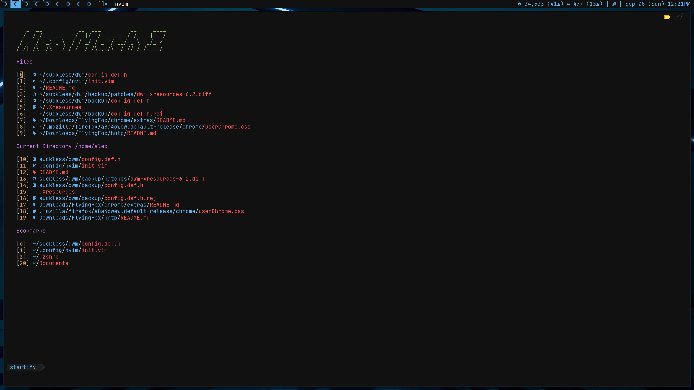

```
       __      __  _____ __
  ____/ /___  / /_/ __(_) /__  _____
 / __  / __ \/ __/ /_/ / / _ \/ ___/
/ /_/ / /_/ / /_/ __/ / /  __(__  )
\__,_/\____/\__/_/ /_/_/\___/____/
```

# My personal dotfiles

### Screenshots



## Things included

- Personal scripts

- My builds of [dwm](https://dwm.suckless.org/), [dmenu](https://tools.suckless.org/dmenu/) and other utilities

- My custom color scheme One drac (tentative name) at the moment only for alacritty, dwm and neovim

- My [shxkd](https://github.com/baskerville/sxhkd) config for my scripts and media control

- My slightly modified versions of [neovim](https://neovim.io/) and [ranger](https://github.com/ranger/ranger),
- based off [Christian Chiarulli's](https://github.com/ChristianChiarulli/nvim) and [Luke Smith's](https://github.com/LukeSmithxyz/voidrice) configs respectively

- Configs for [oh my zsh](https://ohmyz.sh/) and alacritty

- Configs for [picom](https://github.com/yshui/picom) (needs [dual kawase fork](https://github.com/ibhagwan/picom))

## Dependencies

- picom (fork mentioned above)
- my builds of dwm, dmenu, ect. (these configs are meant to interact with my builds)
- ranger (for the ranger and nvim config)
- shxkd (for hotkeys)
- [Nerd Fonts](https://www.nerdfonts.com/) (For the heavy use of Nerd Fonts and JetBrains Mono Nerd Font specifically)
- [maim](https://github.com/naelstrof/maim) (For screenshots in sxhkd )
- [dragon](https://github.com/mwh/dragon) (for ranger use and the aliases)
- [fzf](https://github.com/junegunn/fzf) (for scripts)
- [exa](https://the.exa.website/) (for aliases)
- [Devour](https://github.com/salman-abedin/devour) (Possibly optional but you must change zsh aliases and scripts)

Note: Some of these dependencies may possibly optional but that's an unsupported use case and some basic dependencies (make an issue if this is the case)

## TODO

- Add resources support to [dwm](https://dwm.suckless.org/patches/xresources/) and possibly dmenu

- Add screenshots to README.md

- Fix funky floating windows in dwm

## Credits

[Luke Smith](https://github.com/LukeSmithxyz) For their ranger config and inspiration for dmenu and status scripts

[Christian Chiarulli](https://github.com/ChristianChiarulli) For their slick neovim config

[rpieja](https://github.com/rpieja) For their work on the [i3spotifystatus](https://github.com/rpieja/i3spotifystatus)

[ibhagwan](https://github.com/ibhagwan) For their work on the [dual kawase fork of picom](https://github.com/ibhagwan/picom)
